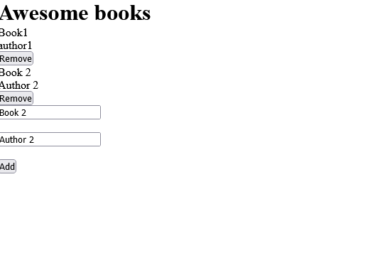

# Awesome books

> In this project, we build a basic website that allows users to add/remove books from a list. We achieve that by using JavaScript objects and arrays.




## Built With

- HTML5
- JavaScript

## Live Demo

[Live Demo Link](https://shinobiwarior.github.io/Awesome-Books/)


## Getting Started

To get a local copy up and running follow these simple example steps.

### Prerequisites

`No prerequisites`

### Setup

Clone the repository with:

```
git clone https://github.com/ShinobiWarior/Awesome-books.git
```
or download [ZIP file](https://github.com/ShinobiWarior/Awesome-Books/archive/refs/heads/books-feature.zip)


To run it online just click on [Live Demo Link](https://shinobiwarior.github.io/Awesome-Books/)


## Authors

👤👤 **Aleksandar Ivezic**

- GitHub: [@Aleksandar Ivezic](https://github.com/ShinobiWarior)
- Twitter: [@AIvezic](https://twitter.com/AIvezic)
- LinkedIn: [Aleksandar Ivezic](https://www.linkedin.com/in/aleksandar-ivezic/)


👤 **Author2**

- GitHub: [@githubhandle](https://github.com/githubhandle)
- Twitter: [@twitterhandle](https://twitter.com/twitterhandle)
- LinkedIn: [LinkedIn](https://linkedin.com/linkedinhandle)

## 🤝 Contributing

Contributions, issues, and feature requests are welcome!

Feel free to check the [issues page](https://github.com/ShinobiWarior/Awesome-Books/issues/).

## Show your support

Give a ⭐️ if you like this project!

## Acknowledgments

- This project was inspired by Microverse


